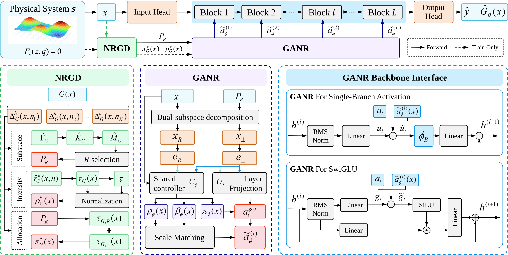

# GA-NAR

**Geometry-aware neural approximation for implicit physical systems**

GA-NAR is a geometry-conditioned neural surrogate framework for solution maps
defined implicitly by nonlinear physical equations. The project accompanies
the GA-NAR ICLR 2027 submission and provides the code, benchmark data,
experiment protocols, and numerical records needed to study the method.

## What this project studies

Many physical models define the state `z` through an implicit relation
`F(z, x) = 0`. A surrogate must therefore approximate a response map whose
local sensitivity changes across the input domain. GA-NAR uses a
Jacobian-derived geometry descriptor to expose that structure to a neural
representation. GA-NAR-LW further applies the descriptor at every hidden
layer, while allowing the backbone activation to be changed independently.

The central equations are provided as pre-rendered SVG assets, so they remain
visible on documentation platforms that do not provide MathJax or KaTeX.

<p align="center"></p>

The response geometry is estimated from directional sensitivities. Its
eigenvectors define the dominant response subspace:

<p align="center"></p>

The rank R is selected from cumulative response mass. For an input x, the two
branches are x<sub>R</sub> = P<sub>R</sub>x and
x<sub>⊥</sub> = (I<sub>d</sub> − P<sub>R</sub>)x. Together with local response
intensity ρ<sub>G</sub><sup>⋆</sup>(x) and allocation
π<sub>G</sub><sup>⋆</sup>(x), they define the NRGD descriptor:

<p align="center"></p>

The local intensity is the normalized trace of the local geometry matrix G(x).
Its allocation coordinates π<sub>G,i</sub><sup>⋆</sup>(x) are the response mass
of mode u<sub>i</sub> divided by the total response, and sum to one.

For each hidden layer, GA-NAR-LW forms a geometry-conditioned additive gate:

<p align="center"></p>

Here e<sub>R</sub> and e<sub>⊥</sub> are the dominant and complementary
geometry embeddings, β<sub>ℓ</sub>(x) distributes modulation energy across
depth, and RMS normalization matches the modulation to the backbone gate
scale. The modulated gate is passed to the selected activation block. For
SwiGLU, only its gate branch is modulated. The depth weights form a softmax
over all blocks and therefore sum to one.

The physical consistency metric reported by the experiments is

<p align="center"></p>

where d<sub>z</sub> is the state dimension. The implementation uses additive gate
modulation rather than feature-wise affine modulation.

## GA-NAR architecture

The diagram summarizes the system-to-network pathway. The physical system
provides standardized input x to the NRGD input head. NRGD first estimates a
global Dominant Nonlinear-Response Subspace (DRS), represented by the projector
P<sub>R</sub>. It also produces two operating-point descriptors: local response
intensity ρ<sub>G</sub><sup>⋆</sup>(x) and dominant/complement allocation
π<sub>G</sub><sup>⋆</sup>(x).

The input is then decomposed into dominant and complementary channels,
x<sub>R</sub> = P<sub>R</sub>x and
x<sub>⊥</sub> = (I<sub>d</sub> − P<sub>R</sub>)x. Separate encoders preserve
these channels as e<sub>R</sub> and e<sub>⊥</sub>; the shared controller combines
them with x and predicts the neural intensity, branch composition, and
depth-allocation vector β. The physical descriptors supervise intensity and
branch composition, while β is learned from the predictive objective because
network depth is not a physical coordinate.

At every nonlinear block, the two encoded channels are mapped into the block's
preactivation coordinates. Their learned branch projections are mixed according
to π, scaled by ρ and β, and RMS-matched to the baseline preactivation. The
resulting additive modulation is injected before the activation. This preserves
the selected activation family rather than replacing it; for SwiGLU, the
modulation is applied only to the gate branch. The output head then maps the
modulated backbone state to the predicted physical state.

Geometry construction, physical Jacobian actions, and descriptor targets are
used only during training and independent evaluation. Inference uses the frozen
descriptor and neural forward path without querying the physical solver.



*GA-NAR architecture. NRGD extracts physical response geometry, and GANR
converts it into layer-wise nonlinear modulation through dual-subspace
encoding, a shared controller, scale-matched projections, RMS normalization,
activation blocks, and the output head.*

## Experimental program

The repository is organized around the four experiment families used in the
submission:

| Component | Purpose | Experimental scope |
| --- | --- | --- |
| **NRGD** | Extract and route Jacobian-informed geometry | Synthetic 50→50, IEEE-118 rich, coupled Duffing, Allen–Cahn 2D, shallow-water 2D |
| **GANR** | Compare geometry-aware representations under matched physics conditions | Five systems, seven model variants, two physics conditions, three seeds |
| **GA-NAR-LW** | Evaluate activation-matched layer-wise geometry conditioning | IEEE-118, Kuramoto-64, and nonlinear heat FEM with six activations |
| **Controlled ablation** | Separate capacity, generic geometry information, and structured modulation | Seven settings, four models, three seeds, including physics residuals |

The main package is [`ganar_reproducibility/`](./ganar_reproducibility/).
It contains the implementation and numerical artifacts for these experiments;
manuscript files, rendered figures, exploratory search outputs, and checkpoints
are intentionally kept outside the source repository.

## Quick start

```bash
cd ganar_reproducibility
python -m pip install -e .

# Inspect the committed numerical records
PYTHONDONTWRITEBYTECODE=1 PYTHONPATH=src \
  python verification/verify_final_reproduction.py
PYTHONDONTWRITEBYTECODE=1 PYTHONPATH=src \
  python verification/audit_result_records.py

# Run a small CPU geometry example
PYTHONDONTWRITEBYTECODE=1 PYTHONPATH=src \
  python experiments/run_nrgd_five_benchmark.py \
  --mode smoke --benchmark synthetic --centers 8 \
  --directions-per-center 2 \
  --output-root local_reproduction_results/nrgd_smoke

# Run one activation-matched GA-NAR-LW training pair
PYTHONDONTWRITEBYTECODE=1 PYTHONPATH=src \
  python experiments/run_ga_nar_lw_matrix.py \
  --system ieee118_acpf --models pm_relu,ganar_relu \
  --seeds 0 --epochs 1 --workers 1 --device cpu \
  --lambda-rho 0.5 --lambda-pi 0.5
```

For the complete registered protocol, use:

```bash
PYTHONDONTWRITEBYTECODE=1 PYTHONPATH=src \
  python experiments/reproduce_all.py --stage all
```

Generated training outputs are written to local ignored directories. The
complete protocol is staged so that geometry descriptors and seed-matched
baseline models are available before paired GA-NAR-LW runs.

## Package structure

```text
ganar_reproducibility/
├── configs/          experiment protocols and final hyperparameters
├── data_store/       frozen datasets, probes, and geometry artifacts
├── experiments/      training, evaluation, and report entry points
├── manifests/        data lineage and result traceability
├── reports/          compact machine-readable summaries
├── results/          numerical records used by the submission
├── src/              NRGD, GANR, GA-NAR-LW, and physics implementations
└── verification/     result and package consistency checks
```

## Artifact availability

The source package is the primary artifact for reviewing the method and
reproducing the numerical study: it contains the implementation, frozen input
data, protocols, and result records. The trained models used for the reported
runs are provided separately in the [companion model archive](https://github.com/Z-JangCC/GA-NAR/releases/tag/final-submission-reproducibility),
with a machine-readable manifest and per-file checksums. Keeping these large
binary artifacts in the release area keeps the source history lightweight while
preserving access to the exact trained models.

## Citation

```bibtex
@inproceedings{ganar2027,
  title     = {GA-NAR: Geometry-Aware Neural Approximation for Implicit Physical Systems},
  booktitle = {International Conference on Learning Representations},
  year      = {2027}
}
```

Please report reproducibility issues with the command, environment, and
relevant output. Changes to experiment code should preserve the published
protocols and update the corresponding numerical traceability records.
